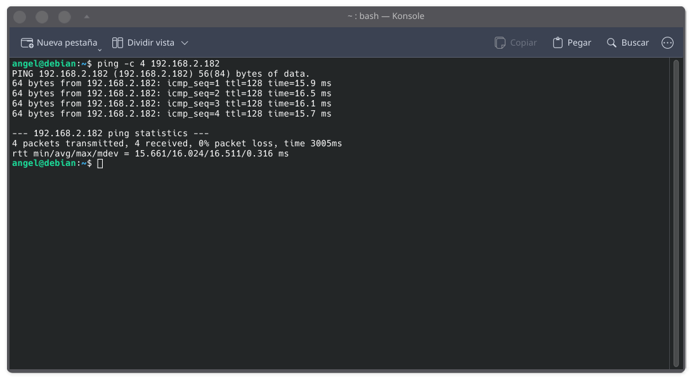
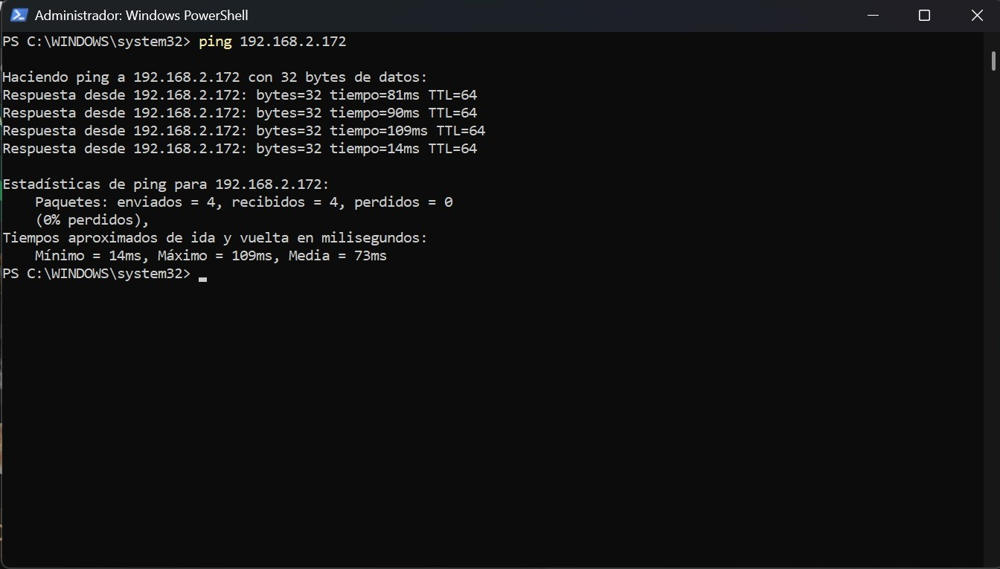

# Malware Analysis Report

## 1. Executive Summary

This report documents the analysis of a suspicious Windows executable in a controlled laboratory environment.

The objective is to observe the sample's behavior, identify relevant Indicators of Compromise (IoCs), and document potential security implications.

## 2. Analysis Objectives

The analysis aims to:

- Identify the analyzed sample.
- Calculate cryptographic hashes.
- Perform basic static analysis.
- Observe process behavior.
- Monitor file and system activity.
- Analyze network communications.
- Extract relevant Indicators of Compromise.
- Document security findings and mitigation measures.

## 3. Laboratory Environment

### Analysis Workstation

- Operating System: Debian Linux
- Role: Analysis and monitoring workstation

### Analysis Target

- Operating System: Windows 11
- Role: Isolated analysis environment

### Network Connectivity

Network connectivity between the analysis workstation and the Windows 11 target was verified before beginning the analysis.

Two ICMP connectivity tests were performed:

- Debian → Windows 11: Successful, 0% packet loss.
- Windows 11 → Debian: Successful, 0% packet loss.

The successful bidirectional communication confirms that both systems can communicate over the local network and establishes the connectivity required for the subsequent laboratory activities.

#### Evidence

**Debian → Windows 11**

**Windows 11 → Debian**

## 4. Sample Information

| Attribute | Value |
|---|---|
| File name | TBD |
| File type | TBD |
| File size | TBD |
| MD5 | TBD |
| SHA-1 | TBD |
| SHA-256 | TBD |

## 5. Static Analysis

The static analysis phase will examine the sample without executing it.

The following information will be collected:

- File type
- File size
- Cryptographic hashes
- PE file information
- Embedded strings
- Imported libraries
- Suspicious indicators

## 6. Dynamic Analysis

The dynamic analysis phase will observe the behavior of the sample during controlled execution.

The following activities will be monitored:

- Process creation
- File system changes
- Registry activity
- Network connections
- Child processes
- Persistence mechanisms

## 7. Network Analysis

Network activity will be monitored to identify:

- Destination IP addresses
- DNS queries
- Destination ports
- HTTP/HTTPS connections
- Suspicious communication patterns

## 8. Indicators of Compromise

The following IoCs will be documented when identified:

| Indicator | Type | Description |
|---|---|---|
| TBD | SHA-256 | Sample hash |
| TBD | IP Address | Network destination |
| TBD | Domain | DNS/network indicator |
| TBD | File Path | Suspicious file location |
| TBD | Registry Key | Persistence or configuration indicator |

## 9. Findings

The findings will be documented after completing the static and dynamic analysis phases.

## 10. Mitigation

Potential mitigation and detection recommendations will be documented based on the observed behavior.

## 11. Conclusion

The analysis will provide a structured assessment of the sample's behavior and relevant security indicators within a controlled environment.
